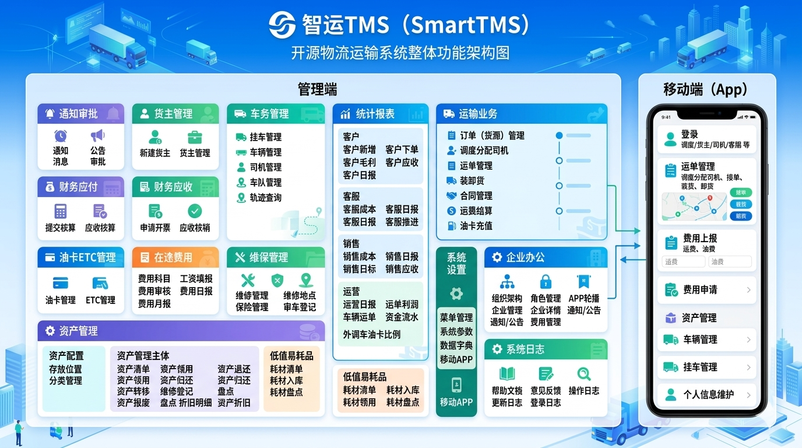

### 智运TMS（SmartTMS）

**智运TMS（SmartTMS）** 是面向物流运输行业的专业TMS管理系统，项目功能非常齐全，**覆盖货主、司机、车辆、挂车、运单、费用、财务、报表、审批、油卡、固定资产等核心业务**，同时支持**管理后台**与**移动端**协同，能够较好满足物流企业日常运营、调度管理和数据分析需求。

基于[SmartAdmin](https://gitee.com/lab1024/smart-admin)技术体系（Java+SpringBoot2+Vue3+Uniapp)，并以 **以代码「简洁、高质量、安全」为核心，同时满足《网络安全-三级等保》、《数据安全》** 要求，支持登录限制、接口国产加解密、数据脱敏等一系列安全要求。

### ⚖️ 开源协议与商业规则
本项目采用 **AGPL-3.0 + 自定义附加条款**。我们支持合规的商业行为，如果您计划将本项目用于商业场景，请务必完成如下3步：
1. **登记备案**：前往 [👉 商业使用登记专用 Issue](https://gitee.com/lab1024/smart-tms/issues/IHT0FE) 按格式提交登记。未登记的使用将被视为违反协议。
2. **保留署名**：在系统界面底部或“关于”中保留：“**核心技术由 [智运TMS（SmartTMS）](https://gitee.com/lab1024/smart-tms) 提供**”。
3. **联系作者**：若您的场景涉及 SaaS 运营、集成销售或第三方分发，必须联系作者获取**高级授权**。

❌ **严禁 SaaS 化**：禁止封装后以云服务租用模式牟利;**严禁三方分发**：禁止将代码提供给其他技术服务商;**严禁打包转售**：禁止将本项目作为组件集成到其他软件中销售。

### 在线预览

- 管理端：[http://lab.tms.1024lab.net/admin/](http://lab.tms.1024lab.net/admin/#/login?previewUser=13700000001&previewPwd=789321) 用户名：13700000001 / 789321
- 移动端：[http://lab.tms.1024lab.net/h5/](http://lab.tms.1024lab.net/h5/pages/login/login?previewUserType=1&previewUser=13700000001&previewPwd=789321)
  员工账号同上;  司机账号：13500000001 / 789321

### 核心功能模块 

#### 管理端
- **通知审批**: 通知、公告、消息、审批
- **货主管理**: 新建货主、货主管理
- **车务管理**: 挂车管理、车辆管理、司机管理、车队管理、轨迹查询
- **运输业务**: 订单（货源）管理、调度分配司机、运单管理、装卸货、合同管理、运费结算、油卡充值
- **在途费用**: 费用科目、工资填报、费用审核、费用日报、费用月报
- **财务应付**: 应付现金、应付油卡
- **财务应收**: 提交核算、应收核算、申请开票、应收核销
- **统计报表**: 客户新增、客户下单、客户毛利、客户应收、客户日报、客服成本、客服日报、客服日推进、销售成本、销售日报、销售目标、销售应收、运营日报、运单利润、车辆运单、资金流水、外调车油卡比例
- **油卡ETC管理**: 油卡管理、ETC管理
- **维保管理**: 维修管理、维修地点、保险管理、审车登记、车辆保养
- **业务资料**: 业务类型、船公司、报关行、柜型、堆场、费用项目、合同类型、货物管理
- **资产配置**：存放位置、分类管理
- **资产管理**：资产清单、资产采购、资产领用、资产退还、资产借用、资产归还、资产调拨、资产转移、维修登记、资产报废、盘点、折旧明细、资产折旧
- **低值易耗品**：耗材清单、耗材入库、耗材领用、耗材盘点
- **企业办公**: 组织架构、角色管理、APP轮播、企业管理、企业详情、通知/公告、费用管理
- **系统设置**: 菜单管理、系统参数、数据字典、移动APP
- **系统日志**: 帮助文档、意见反馈、操作日志、更新日志、登录日志

#### 移动端
- **登录**: 调度/货主/司机/客服 等
- **运单管理**: 调度分配司机、接单、装货、卸货
- **费用上报**: 运费、油费、
- **费用申请**: 
- **车辆管理**:
- **挂车管理**:
- **个人信息维护**:

### 项目截图
<table>
<tr>
    <td></td>
    <td></td>
</tr>
<tr>
    <td></td>
    <td></td>
</tr>
<tr>
    <td></td>
    <td></td>
</tr>
<tr>
    <td></td>
    <td></td>
</tr>
</table>

---

### 技术体系
- 前端：JavaScript + Vue3 + Vite5 + Pinia + Ant Design Vue 4.X
- 移动端：uniapp  + uni-ui + （同时支持APP、小程序、H5）
- 后端：Java8 + SpringBoot2 + Spring Security + Mybatis-plus + Mysql8

---

### 联系方式

<table>
<tr>
    <td width="200px"></td>
</tr>

</table>

### 💎 想要更强大的功能？
如果您是企业级客户，开源版仅提供基础作业流。**商业企业版** 额外提供：
- [ ] ETC开票： 百望、路耘 
- [ ] 车辆轨迹： 中交兴路 
- [ ] 电子签章： 尚尚签、君子签、e签宝 
- [ ] 银企直连： 平安银行、华夏银行、宁波银行、郑州银行等 
- [ ] 地图&nbsp;&nbsp;&nbsp;&nbsp;&nbsp;&nbsp;&nbsp;： 百度地图 
- [ ] OCR识别： 百度、阿里、华为 
- [ ] 文件存储： 本地存储、阿里OSS、华为OBS等 
- [ ] 短信服务： 阿里云短信 

**联系作者获取企业版：** [邮箱：zhuoluodada@qq.com / 微信：zhuoda1024]

