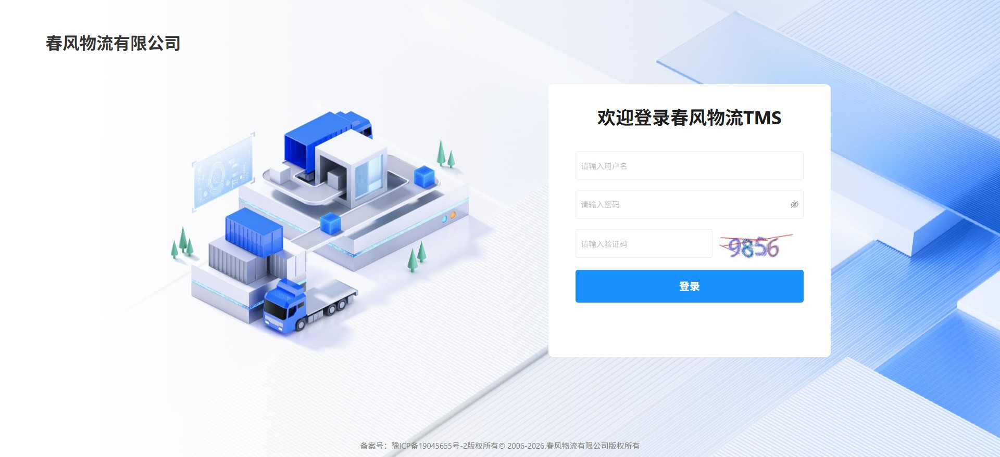
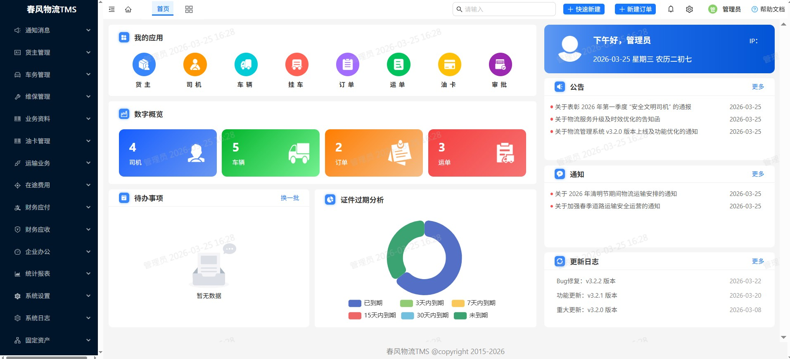
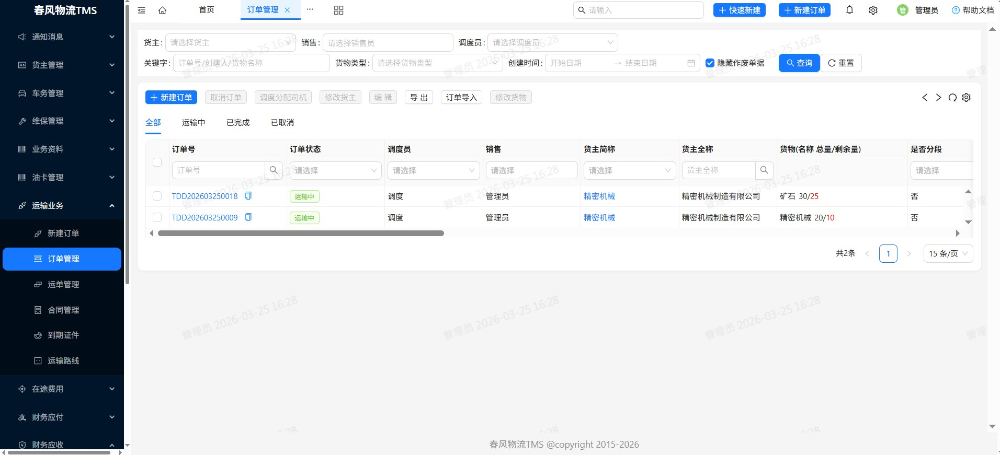
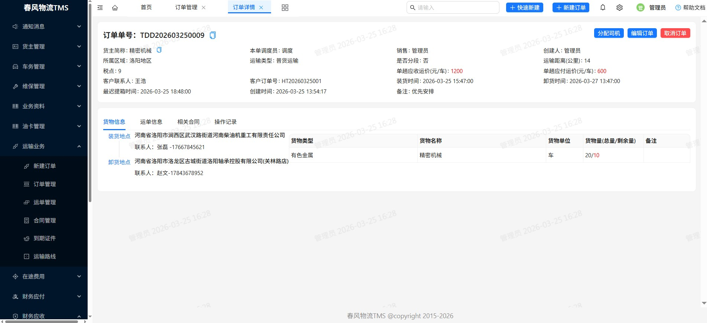
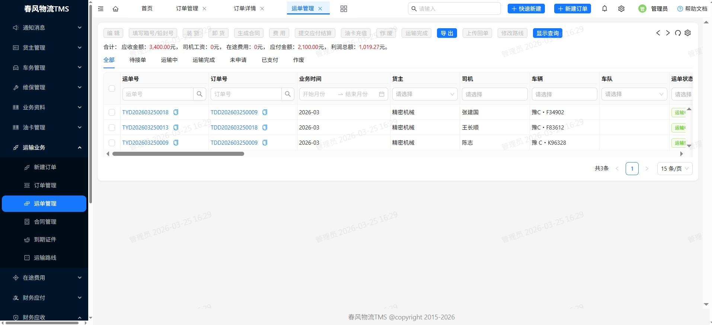
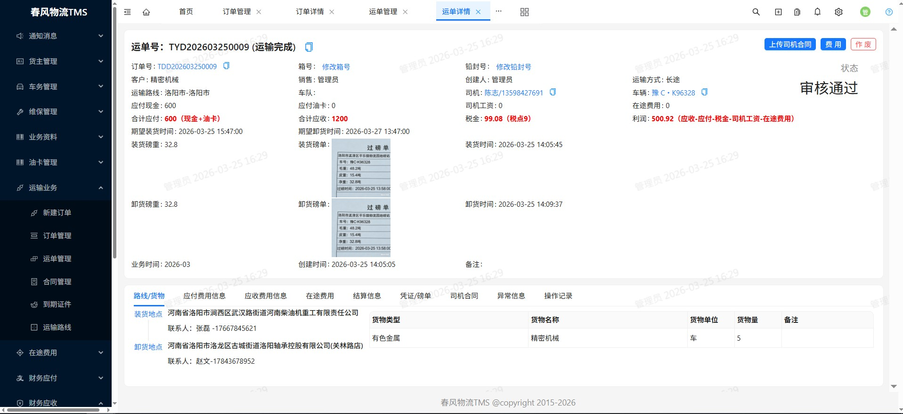
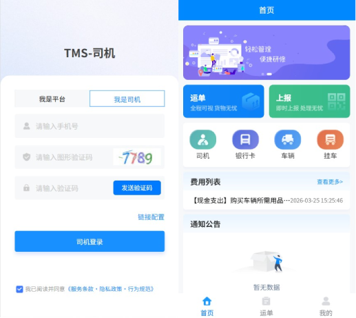
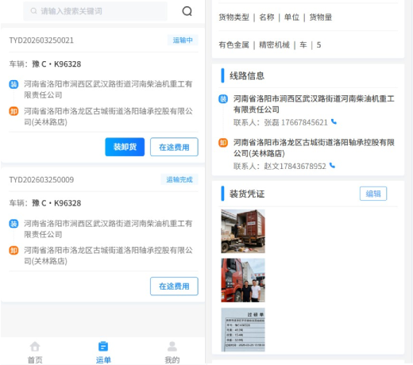

# TMS 运输管理系统

## 授权
本项目基于 Apache 2.0 协议，并附加 Commons Clause 限制：
- 非商用可自由使用、修改、分发
- 商用（含销售、收费服务、企业生产）需联系作者获取商业授权

## 项目简介

TMS (Transportation Management System) 是一套完整的运输管理系统，由 **中国·洛阳** [1024创新实验室](https://www.1024lab.net/) 开发。系统采用 Spring Boot 框架，基于 Java 8 和 Maven 多模块架构设计，提供货主管理、司机管理、车辆管理、挂车管理、业务资料、油卡管理、报表统计、流程审批、固定资产等核心功能。

在线预览（演示环境数据每天早上8点重置）：

**管理端**
- [http://lab.tms.1024lab.net/admin/](http://lab.tms.1024lab.net/admin/#/login?previewUser=13700000001&previewPwd=789321)
- 用户名：13700000001 / 789321

**移动H5**
- [http://lab.tms.1024lab.net/h5/](http://lab.tms.1024lab.net/h5/)
- 打开链接后配置链接地址为：http://lab.tms.1024lab.net
- 员工账号：13700000001 / 789321
- 司机账号：13500000001 / 789321

### 核心技术
**项目技术栈**
- 开发语言： Java 1.8 
- 开发框架： SpringBoot 2.5.2 
- 构建工具： Maven 
- 数据存储： Mysql 8.0.23 
- 缓存实现： Redis 
- 接口文档： Swagger
- 数据访问： Mybatis Plus-  3.4.1 
- 权限控制： Spring Security 
- 工具类库： Hutool 5.7.22 

**第三方服务(部分扩展功能暂不开放)**
- ETC开票： 百望、路耘 
- 车辆轨迹： 中交兴路 
- 电子签章： 尚尚签、君子签、e签宝 
- 银企直连： 平安银行、华夏银行、宁波银行、郑州银行等 
- 地图&nbsp;&nbsp;&nbsp;&nbsp;&nbsp;&nbsp;&nbsp;： 百度地图 
- OCR识别： 百度、阿里、华为 
- 文件存储： 本地存储、阿里OSS、华为OBS等 
- 短信服务： 阿里云短信 

## 项目预览
<table>
<tr>
    <td></td>
    <td></td>
</tr>
<tr>
    <td></td>
    <td></td>
</tr>
<tr>
    <td></td>
    <td></td>
</tr>
<tr>
    <td></td>
    <td></td>
</tr>
</table>

## 核心功能模块

### 1. 管理后台 (tms-admin)
- **通知消息**: 通知/公告、消息通知
- **货主管理**: 新建货主、货主管理
- **车务管理**: 挂车管理、车辆管理、司机管理、车队管理、轨迹查询
- **维保管理**: 维修管理、维修地点、保险管理、审车登记、车辆保养
- **业务资料**: 业务类型、船公司、报关行、柜型、堆场、费用项目、合同类型、货物管理
- **油卡管理**: 油卡管理、ETC管理
- **运输业务**: 运输业务信息维护，运输业务查询
- **在途费用**: 费用科目、工资填报、费用审核、费用日报、费用月报
- **财务应付**: 应付现金、应付油卡
- **财务应收**: 提交核算、应收核算、申请开票、应收核销
- **企业办公**: 组织架构、角色管理、APP轮播、企业管理、企业详情、审批列表、通知/公告、费用管理
- **统计报表**: 客户新增、客户下单、客户毛利、客户应收、客户日报、客服成本、客服日报、客服日推进、销售成本、销售日报、销售目标、销售应收、运营日报、运单利润、车辆运单、资金流水、外调车油卡比例
- **系统设置**: 菜单管理、系统参数、数据字典、移动APP
- **系统日志**: 帮助文档、意见反馈、操作日志、更新日志、登录日志、

### 2. 固定资产模块 (tms-fixed-asset)
- #### 资产管理
    - 存放位置
    - 分类管理
- #### 资产管理
    - 资产清单
    - 资产采购
    - 资产领用
    - 资产退还
    - 资产借用
    - 资产归还
    - 资产调拨
    - 资产转移
    - 维修登记
    - 资产报废
    - 盘点
    - 折旧明细表
    - 资产折旧
- #### 低值易耗品
    - 耗材清单
    - 耗材入库
    - 耗材领用
    - 耗材盘点

### 3. 司机端模块 (tms-driver)
- 运单管理
- 费用上报
- 费用申请
- 车辆管理
- 挂车管理
- 个人信息维护

## 维护团队

本项目由 **1024lab** 团队开发和维护。
<table>
<tr>
    <td width="200px"></td>
</tr>

</table>

## 许可证

请查看项目根目录的 LICENSE 文件获取许可信息。

